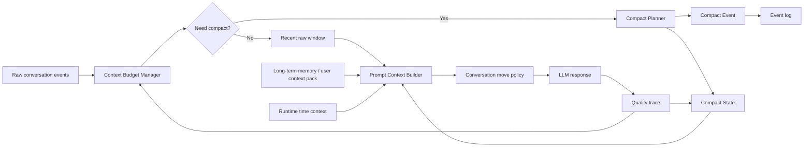

# 长对话 Compact 与心理陪伴上下文治理设计

## 背景

当前项目已经具备会话摘要、长期记忆、用户上下文包、对话策略、质量观测、时间感知与风险策略等能力，但长对话仍然会出现三个典型问题：

1. 最近窗口滑动后，模型忘掉早前仍然重要的情绪线索。
2. 普通摘要太像历史概括，无法直接约束下一轮该承接什么、避开什么。
3. 长期记忆不适合承接每一段临时情绪，过早写入会污染用户画像。

这类问题在心理陪伴场景里比通用问答更敏感。用户经常在多轮里试探边界、修改表达、撤回判断，甚至只是短暂提到一个比喻或文化锚点。如果系统在后续多轮反复提这个锚点，会让用户感到被纠缠；如果系统完全忘掉用户刚才的情绪，又会显得没有陪伴感。

因此，本 spec 重新设计一个心理场景专用 compact 机制：它不是普通“聊天记录摘要”，而是一个可审计、可回滚、可注入策略的会话上下文治理层。

## 外部参考

这次设计参考了几个成熟 agent 的 compact / condenser 经验：

1. Claude API Compaction：服务端在 token 超过阈值时生成 `compaction` block，后续请求从压缩块继续；支持触发阈值、自定义压缩指令、压缩后暂停。
   来源：[Claude API Compaction](https://platform.claude.com/docs/en/build-with-claude/compaction)

2. Claude Code：建议在上下文质量下降前主动 `/compact <hint>`，并显式告诉模型保留什么、丢掉什么；新任务用 `/clear`，高噪声探索用 subagent 隔离。
   来源：[Using Claude Code: session management and 1M context](https://claude.com/blog/using-claude-code-session-management-and-1M-context)

3. OpenHands Condenser：把历史视为事件流，保留头部关键事件和最近尾部，压缩中间部分，并追加 `Condensation` 事件记录 `forgotten_event_ids`。
   来源：[OpenHands Condenser](https://docs.openhands.dev/sdk/arch/condenser)

4. Cline Auto Compact：接近上下文限制时自动总结，保留关键决策与上下文；通过 checkpoints 支持恢复 compact 前状态。
   来源：[Cline Auto Compact](https://docs.cline.bot/features/auto-compact)

5. Aider：用 `--max-chat-history-tokens` 作为软阈值，超过后开始 chat history summarization，也可用弱模型承担摘要任务。
   来源：[Aider options reference](https://aider.chat/docs/config/options.html)

6. goose：默认在 80% token 使用率触发自动 compact，支持手动 `/summarize`，并对旧工具输出做后台摘要。
   来源：[goose Smart Context Management](https://goose-docs.ai/docs/guides/sessions/smart-context-management/)

这些经验不能直接照搬。代码 agent 关心文件、决策、错误、待办；心理陪伴 agent 更关心情绪线、关系边界、风险信号、用户偏好、话题新鲜度和重复风险。

## 设计结论

推荐采用“事件式 compact + 结构化心理会话状态 + 最近原文窗口”的方案。

核心不是把全部历史揉成一段摘要，而是保留三层上下文：

1. 最近原文窗口：保留用户最近的原话和助手最近的回应，确保措辞、语气、上下文不丢。
2. Compact Event：把被压缩的历史段落替换为可审计的 compact 事件，记录被压缩 turn ids、摘要、触发原因和质量标记。
3. Compact State：面向下一轮回复的结构化状态，保存情绪弧线、活跃话题、旧锚点新鲜度、用户边界、风险上下文与互动偏好。

这样模型不是“记得更多”，而是知道下一轮“该接什么、该避开什么、哪些内容已经 stale”。

## 目标

1. 支持长会话持续进行，降低 token 压力和上下文退化。
2. 避免旧话题、旧比喻、旧文化锚点被反复复用。
3. 保留用户仍然在表达的情绪线和未完成话题。
4. 明确区分短期会话状态、长期记忆候选和稳定长期记忆。
5. 让 compact 过程可审计、可调试、可回滚。
6. 为后续多端恢复、会话交接、阶段性复盘打基础。

## 非目标

1. 不替代长期记忆系统。
2. 不把 compact 暴露成普通用户需要手动管理的功能。
3. 不做心理诊断摘要，不生成疾病标签。
4. 不把全部历史永久保存到 prompt。
5. 不在第一期引入新的向量索引或复杂检索系统。

## 当前项目映射

现有模块中，`session_digest` 和 `last_summary` 更像历史摘要；`user_context_pack` 和长期记忆更像跨会话画像；`conversation_move_policy` 和 `conversation_quality_trace` 更像策略与观测层。

compact 应该成为三者中间的运行态：

1. 从 `recent_messages`、`session_digest`、质量观测、风险策略中读取输入。
2. 生成一个面向下一轮回复的 compact state。
3. 把 compact state 注入 prompt，并供 `conversation_move_policy` 判断下一轮动作。
4. 只把稳定、明确、对未来支持有价值的信息作为长期记忆候选，不直接写入长期记忆。

## 核心架构



### Context Budget Manager

负责估算当前 prompt 压力，并决定是否触发 compact。

建议阈值：

1. 70%：进入预警状态，只记录指标，不一定压缩。
2. 80%：自动 compact，优先压缩中间历史。
3. 90%：强制 compact，如果压缩后仍超限，则缩短最近窗口。
4. 模型 token 计数不可用时，使用字符数和消息数的保守估算作为 fallback。

同时保留轮数触发：每 6 到 8 个用户回合可做一次轻量 compact 检查，但真正压缩仍由 token、质量、风险和会话阶段共同决定。

### Compact Planner

负责决定“压缩哪一段、保留哪一段、写成什么状态”。

借鉴 OpenHands 的 rolling window 思路：

1. 保留头部关键事件：初始系统约束、当前会话目标、用户明确边界。
2. 保留尾部最近原文：最近 6 到 10 轮消息不压缩。
3. 压缩中间段：把已经滑出最近窗口、但仍有价值的历史变成 compact event。
4. 丢弃无价值噪声：重复寒暄、失败的旧追问、已经被用户否定的话题不进入 active state。

心理场景额外要求：最近原文窗口优先保留用户原话，因为情绪强度、犹豫、否定、转折通常藏在措辞里。

### Compact Event

Compact event 是追加到事件流里的审计记录，不是直接覆盖原始数据库。

建议结构：

```json
{
  "type": "compact_event",
  "schema_version": 1,
  "thread_id": "thread_123",
  "compact_id": "compact_20260517_001",
  "trigger": {
    "reason": ["token_threshold", "quality_repetition_risk"],
    "token_usage_ratio": 0.82,
    "turn_count_since_last_compact": 7
  },
  "range": {
    "forgotten_turn_ids": ["turn_4", "turn_5", "turn_6", "turn_7"],
    "summary_offset_turn_id": "turn_4",
    "kept_head_turn_ids": ["turn_1", "turn_2"],
    "kept_tail_turn_ids": ["turn_18", "turn_19", "turn_20"]
  },
  "summary": "用户从压力和烦躁开始表达，曾短暂提到某个比喻，但后续没有继续展开；系统应保留情绪线，不继续复用该比喻。",
  "quality_flags": {
    "summary_confidence": "medium",
    "risk_signal_preserved": true,
    "stale_anchor_filtered": true
  },
  "created_at": "2026-05-17T12:31:00+08:00"
}
```

`forgotten_turn_ids` 表示这些 turn 不再进入 active prompt，但原始历史仍在数据库里。这样后续可以复盘 compact 是否压坏了上下文。

### Compact State

Compact state 是真正注入下一轮 prompt 的结构化状态。

建议结构：

```json
{
  "schema_version": 1,
  "thread_id": "thread_123",
  "summary_for_prompt": "用户当前主要在表达烦躁和被压迫感，来源尚未明确。回应应先承接感受，不急着分析原因。",
  "emotional_arc": [
    {
      "turn_range": "12-20",
      "emotion": "烦躁、委屈、压迫感",
      "evidence": "用户说情绪不好、很生气、像被什么东西压着",
      "status": "active",
      "confidence": "medium"
    }
  ],
  "active_threads": [
    {
      "topic": "用户感觉被外界推着走",
      "last_user_position": "用户还没有说明具体来源",
      "should_continue": true,
      "next_move_hint": "先共情，再轻问是否愿意说说来源"
    }
  ],
  "stale_threads": [
    {
      "topic": "在轮下",
      "stale_reason": "用户多轮没有主动继续提及",
      "reuse_policy": "除非用户再次主动提起，否则不要复用"
    }
  ],
  "user_boundaries": [
    "用户不喜欢被强行分析",
    "用户对重复旧词和过度追问较敏感"
  ],
  "interaction_preferences": [
    "像陪伴者一样回应",
    "少讲大道理",
    "先承接，再提出一个轻问题"
  ],
  "safety_context": {
    "risk_level": "low",
    "risk_evidence": [],
    "last_checked_at": "2026-05-17T12:31:00+08:00"
  },
  "time_context_policy": {
    "timezone": "Asia/Wuhan",
    "source": "runtime",
    "use_policy": "可以自然体现早晚和作息，不要假装是从记忆里知道"
  },
  "quality_signals": {
    "recent_repetition_risk": "high",
    "recent_over_questioning_risk": "medium",
    "last_quality_issue": "旧锚点被连续提及"
  },
  "last_compact_id": "compact_20260517_001",
  "updated_at": "2026-05-17T12:31:00+08:00"
}
```

### State 字段原则

`summary_for_prompt` 必须短，只保留下一轮有用的信息。

`emotional_arc` 只描述表达出来或谨慎推断的情绪，不做诊断。

`active_threads` 只保存用户仍在主动推进、或明显还没说完的话题。

`stale_threads` 是本设计的关键字段。任何用户没有主动延续的锚点、比喻、文化表达，都应该进入 stale，而不是继续成为追问目标。

`time_context_policy` 不保存某一刻的“当前时间”，只保存时区和使用原则。每轮真实时间必须由运行时注入。

## Prompt 注入策略

compact state 不应原样塞进 prompt，而应转换成短小、可执行的上下文片段。

示例：

```text
当前会话压缩状态：
- 用户现在主要表达烦躁、委屈和被压迫感，来源尚未明确。下一轮先承接感受，不急着解释原因。
- “在轮下”属于旧锚点，用户多轮没有主动继续提。除非用户再次提起，不要复用这个词。
- 用户对被分析和连续追问较敏感。每轮最多一个轻问题，优先用陪伴式回应。
- 当前时间由运行时提供：Asia/Wuhan，2026-05-17 12:31。可以自然体现午间时间感，但不要刻意强调。
- 风险等级当前为 low；普通陪伴即可，继续留意自伤、自杀、绝望等信号。
```

注入规则：

1. 用行为指令表达 compact 结果，例如“不要复用旧锚点”“先承接再轻问”。
2. 每条状态都要能影响下一轮回应，否则不注入。
3. 风险信息只给内部策略使用，不在普通回复里暴露等级。
4. 时间信息每轮重新注入，compact 只提供时区与自然使用策略。
5. 如果 compact state 与最近原文冲突，最近原文优先。

## 触发策略

### 自动触发

1. token 使用率达到 80%。
2. 最近窗口超过配置的消息数或字符数。
3. 质量观测标记重复、跑题、旧锚点复用、过度追问。
4. 风险等级变化。
5. 会话从探索阶段进入复盘、收束、危机响应等新阶段。

### 强制触发

1. token 使用率达到 90%。
2. 模型返回上下文超限错误。
3. 长工具输出或 RAG 结果导致 prompt 暴涨。

### 手动触发

第一期不面向普通用户暴露手动 compact。可以提供开发/调试级触发方式，例如内部 endpoint 或管理命令，用于复现长对话问题。

手动触发时应支持 compact hint：

```json
{
  "focus": [
    "保留用户当前情绪线",
    "保留用户明确边界",
    "丢弃已经 stale 的旧锚点",
    "不要把临时情绪写成长期画像"
  ]
}
```

这对应 Claude Code `/compact <hint>` 的经验：压缩不是让模型自由猜重点，而是让系统明确告诉它保留什么。

## 多次 Compact 策略

多次 compact 不应不断摘要摘要，导致细节逐层丢失。建议：

1. 保留最近一个 compact state 作为 active state。
2. 保留 compact event 链路用于审计。
3. 新 compact 生成时读取上一次 compact state、最近原文和被压缩中间段。
4. 如果连续两次 compact 后质量下降，降低压缩强度并扩大最近窗口。
5. 如果同一会话 compact 次数过多，提示系统进入阶段性收束，避免无限延长低质量会话。

## 与长期记忆的边界

compact state 是短期运行态，长期记忆是跨会话资产。

可以进入长期记忆候选的信息必须满足三个条件：

1. 稳定：多次出现，或用户明确确认。
2. 有用：未来支持用户时确实能改善体验。
3. 安全：不把诊断、风险等级、临时情绪固化成标签。

例如：

| 信息 | compact | 长期记忆 |
| --- | --- | --- |
| “我今天很烦” | 可以保存 | 不直接写入 |
| “我不喜欢别人一直追问” | 可以保存 | 多次出现后可作为互动偏好候选 |
| “我最近总是睡不着” | 可以保存 | 需谨慎，不能写成诊断 |
| “晚上提醒我早点睡” | 可以保存 | 用户明确表达后可作为偏好候选 |

## 与现有模块关系

`session_digest`：作为历史摘要输入，不再直接承担下一轮策略控制。

`last_summary`：继续保留轻量摘要角色，可逐步被 compact event 替代。

`user_context_pack`：提供长期偏好和稳定事实，compact 不反向覆盖它。

`conversation_move_policy`：读取 compact state，决定共情、追问、复盘、收束、边界回应等动作。

`conversation_quality_trace`：提供 compact 触发信号，并评估 compact 后是否改善重复和跑题。

`risk_response_policy`：继续负责风险判断。compact 只保存必要短期风险上下文，避免窗口滑动导致高危线索丢失。

`time_context`：每轮由运行时注入当前 Asia/Wuhan 时间。compact 只保存时区和使用策略，不保存过期时间。

## 失败与回退

| 场景 | 风险 | 回退策略 |
| --- | --- | --- |
| compact 生成失败 | 长对话连续性下降 | 使用上一版 compact state 和最近窗口 |
| compact 过度概括 | 误解用户 | 保留 evidence 字段，禁止无证据诊断 |
| compact 引入旧话题 | 用户感到被纠缠 | stale_threads 强制降权 |
| compact 后仍超限 | 请求失败 | 缩短最近窗口，保留风险和边界字段 |
| 连续 compact 质量下降 | 摘要漂移 | 暂停自动 compact，扩大最近原文窗口 |
| 风险上下文丢失 | 高危响应不稳 | 风险变化立即更新 safety_context |
| 长期记忆污染 | 临时状态变永久画像 | 长期写入必须走候选审核 |

## 隐私与伦理

compact 保存的是对话运行状态，不是心理诊断档案。字段命名必须避免病理化，例如“用户表达出持续低落”优于“用户抑郁”。风险字段只用于内部策略，不应在普通回复中裸露。对于隐私、创伤、关系细节，只有当前会话确实需要时才进入 compact，并尽量保存最小必要信息。

## 可观测性

每次 compact 应记录：

1. 触发原因。
2. 压缩前后 token 估算。
3. 被压缩 turn ids。
4. 保留的 head/tail turn ids。
5. compact state 字段长度。
6. 是否存在 stale anchor。
7. compact 后 3 轮内的重复率、追问密度、用户纠正次数。

这些指标可以进入现有 `conversation_quality_trace`，用于判断 compact 是否真的改善了对话，而不是只是省 token。

## 测试计划

### 单元测试

1. compact event schema 可以稳定序列化和反序列化。
2. compact state schema 可以兼容缺省字段。
3. token 阈值、轮数阈值、质量触发、风险触发均能正确判断。
4. `stale_threads` 中的锚点不会被 prompt 注入为继续追问目标。
5. `time_context_policy` 不会保存过期的具体时间。

### 集成测试

1. 构造 20 轮长对话，验证中间历史被压缩，最近原文仍保留。
2. 构造“用户早期提过某锚点，后续没有再提”的对话，验证系统不会反复复用该锚点。
3. 构造“用户主动再次提旧话题”的对话，验证 stale topic 可以恢复为 active。
4. 构造时间询问对话，验证系统使用运行时 Asia/Wuhan 时间。
5. 构造风险等级变化对话，验证 `safety_context` 更新且风险策略仍生效。

### 回归评测

1. 长对话重复率下降。
2. 旧锚点误复用率下降。
3. 用户主动延续话题承接率上升。
4. 过度追问率下降。
5. prompt token 增长曲线低于单纯扩大最近窗口。
6. compact 后 3 轮内不出现明显上下文断裂。

## 验收标准

1. 后端存在 compact event 与 compact state 两类结构。
2. compact 不覆盖原始历史，而是追加事件并在 prompt view 中隐藏被压缩 turn。
3. prompt 构建器能组合最近原文、compact state、长期记忆和运行时时间。
4. 旧锚点在 stale 后不会连续多轮被复用。
5. 用户主动重新提起旧话题时，系统可以恢复该话题。
6. compact 失败时系统能使用上一版状态继续对话。
7. 关键测试覆盖 token 触发、质量触发、stale anchor、时间感、风险上下文和长期记忆边界。

## 分期建议

### 第一期：事件式 compact 基础闭环

新增 compact event、compact state、触发器、prompt view 构建器。先解决最近窗口、中间压缩、旧锚点降权和运行时时间注入。

### 第二期：质量观测联动

把 `conversation_quality_trace` 的重复、追问、跑题、旧锚点误用、上下文断裂指标接入 compact 触发与 compact 后评估。

### 第三期：长期记忆候选审核

从 compact state 中生成长期记忆候选，但必须经过稳定性、用户确认度和伦理边界审核。

### 第四期：会话恢复与调试工具

增加开发者视角的 compact event 查看、compact 前后 prompt diff、手动 compact hint，以及必要的回滚/重建能力。

## 面试表达

可以这样说明这个设计：

> 通用大模型通常用上下文窗口或普通摘要续聊，但心理陪伴不能简单把历史塞长，也不能把临时情绪写进长期画像。我参考 Claude Code、OpenHands、Cline 这类 agent 的 compact 机制，给项目设计了心理场景专用的上下文治理层：保留最近原文，把中间历史压成可审计 compact event，再生成结构化 compact state。这个 state 会记录情绪线、用户边界、风险信号、旧锚点是否 stale，以及下一轮该怎么回应。这样模型不是单纯“记得更多”，而是知道什么时候该承接，什么时候该停下，什么时候不要再提用户没主动延续的话题。

这能体现项目和普通聊天机器人的差异：它不只是安慰用户，而是在做长对话里的情绪连续性、边界保护和安全治理。
