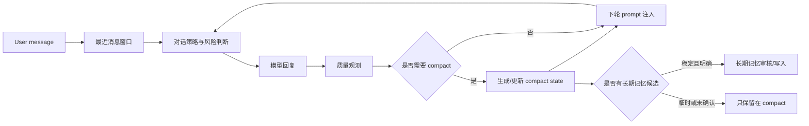

# 长对话 Compact 与心理场景上下文压缩设计

## 背景

当前项目已经具备会话摘要、用户上下文包、长期记忆、对话策略、质量观测与风险策略等能力，但长对话仍存在一个明显缺口：模型在多轮之后容易同时丢失“刚刚发生的事”和“这段关系里真正重要的事”。如果只依赖最近消息窗口，早期情绪线索会消失；如果只依赖长期记忆，又容易把短期、临时、未确认的信息过早固化。

心理陪伴场景对这个问题尤其敏感。用户不是只在问答，他们是在一段连续关系里表达感受、试探边界、修改说法、撤回前面的判断。系统需要在长会话中保留足够的连续性，同时避免反复提及用户没有主动延续的话题，避免让陪伴感变成“记忆压迫感”。

本 spec 设计一个线程级 compact 机制：在最近原文窗口与长期记忆之间增加一层“会话压缩状态”，用于保留当前会话仍然有用的情绪线、未完成话题、用户边界、策略信号与互动偏好。

## 目标

1. 长对话中保持连续陪伴感，让模型知道“刚刚聊到哪里”“用户现在是什么状态”“哪些话题还在场”。
2. 降低上下文长度压力，避免把全部历史消息塞进 prompt。
3. 明确区分短期会话状态与长期个人记忆，减少把临时情绪误写成永久偏好。
4. 支持对话策略更稳地判断：什么时候共情、什么时候追问、什么时候收束、什么时候不要重复旧话题。
5. 为后续实现“阶段性复盘”“对话交接”“多端连续会话”打基础。

## 非目标

1. 不替代长期记忆系统。compact 只保存当前会话内仍然有用的上下文，不承担长期用户画像沉淀。
2. 不引入复杂向量检索。compact 是结构化状态，不是新的 RAG 索引。
3. 不做临床诊断摘要。它只能描述用户表达与对话动态，不能生成疾病判断。
4. 不把所有用户细节都压缩进状态。只有与当下回应质量、风险判断、边界保护有关的信息才进入 compact。

## 当前现状诊断

现有能力大致可以分成三类：

1. `session_digest` / `last_summary`：能提供会话摘要，但更偏“历史概括”，对当前对话动作的约束较弱。
2. `user_context_pack` / 长期记忆：能保留用户偏好、事实、关系线索，但不适合保存每一段临时情绪和刚刚出现的试探性话题。
3. `conversation_move_policy` / `conversation_quality_trace`：能指导每轮怎么说、怎么观测质量，但需要一个更稳定的中间状态来理解“这轮为什么该这么说”。

缺口是：缺少一个可以在每几轮更新、直接注入 prompt、并且不会污染长期记忆的“当前会话状态”。

## 方案比较

### 方案 A：只扩大最近消息窗口

做法是把更多原文消息放进 prompt。

优点是实现简单，语义最完整。缺点是 token 成本增长快，并且原文越多，模型越可能被旧话题牵引，重复提及用户已经没有继续说的内容。对于心理陪伴场景，这会放大“你怎么还在提那件事”的烦躁感。

结论：不推荐作为主方案，只能作为短期兜底。

### 方案 B：只依赖长期记忆与用户画像

做法是把重要信息沉淀到长期记忆，让每轮从用户画像里取上下文。

优点是跨会话连续性强。缺点是长期记忆应该慢写、慎写，不能承接每轮对话的细微变化。比如用户某一晚说“我很烦”，这可能是当下状态，不应该立刻变成长期画像。

结论：适合沉淀稳定事实，不适合解决长对话中的短期连续性。

### 方案 C：线程级 compact state

做法是在最近消息窗口与长期记忆之间新增一层结构化 compact state。每隔一定轮数或 token 阈值更新一次，把当前会话的情绪线、活跃主题、用户边界、策略信号压缩成可控字段。

优点是能同时保留连续性、降低 token 压力、减少旧话题误触发，并且能与现有策略模块解耦。缺点是需要新增状态维护、更新时机与测试。

结论：推荐采用。

## 核心设计

### 上下文分层

最终 prompt 的上下文由三层组成：

1. 最近原文窗口：保留最近 6 到 10 轮消息，优先保证当下语义不丢。
2. 会话 compact state：保留本次会话中仍然活跃、但已经滑出最近窗口的重要信息。
3. 长期记忆与用户画像：保留跨会话稳定事实、明确偏好、长期关系线索与经过确认的支持方式。

这三层的边界要清晰：最近窗口负责“刚才怎么说的”，compact 负责“这段会话正在发生什么”，长期记忆负责“这个人稳定地是什么样”。

### Compact State Schema

建议在后端增加线程级 compact 对象，字段如下：

```json
{
  "schema_version": 1,
  "summary_for_prompt": "本次会话的短摘要，只保留与当前回应有关的信息。",
  "emotional_arc": [
    {
      "turn_range": "12-18",
      "emotion": "烦躁、委屈",
      "evidence": "用户提到被压着、喘不上气、很生气",
      "status": "active"
    }
  ],
  "active_threads": [
    {
      "topic": "用户感觉被外界推着走",
      "last_user_position": "用户还没有明确来源，只描述为一种压迫感",
      "should_continue": true,
      "repeat_risk": "不要反复提同一个比喻或地点词"
    }
  ],
  "unresolved_threads": [
    {
      "topic": "是否和现实关系或具体事件有关",
      "reason_to_hold": "用户尚未主动展开，下一轮只在自然处轻问"
    }
  ],
  "user_boundaries": [
    "用户不喜欢被强行分析",
    "用户对重复旧词较敏感"
  ],
  "interaction_preferences": [
    "回应要像陪伴者，不要像流程化咨询师",
    "多承接用户原话，少连续追问"
  ],
  "safety_context": {
    "risk_level": "low",
    "risk_evidence": [],
    "last_checked_at": "2026-05-17T12:30:00+08:00"
  },
  "anchor_state": {
    "recent_anchor": "用户提到'在轮下'",
    "anchor_status": "stale",
    "reuse_policy": "除非用户再次主动提及，否则不要继续复用"
  },
  "quality_signals": {
    "recent_repetition_risk": "high",
    "recent_missed_time_awareness": true,
    "last_quality_issue": "系统不知道当前时间，影响陪伴感"
  },
  "last_compacted_turn_id": "turn_18",
  "updated_at": "2026-05-17T12:31:00+08:00"
}
```

### 字段原则

`summary_for_prompt` 要短，只放能直接改善下一轮回复的信息。`emotional_arc` 不要诊断用户，只描述表达出来或可谨慎推断的情绪变化。`active_threads` 只保存用户仍在主动推进或明显还没说完的话题。`anchor_state` 用来控制文化锚点、比喻、特殊词语的复用，避免系统把一个偶然词汇说成固定主题。

## Compact 触发条件

建议使用组合触发：

1. 轮数触发：每 6 到 8 个用户回合更新一次。
2. token 触发：最近原文窗口超过目标 token 阈值时更新。
3. 质量触发：质量观测发现重复、跑题、旧锚点过度复用、时间感缺失等问题时，提前更新。
4. 风险触发：风险等级变化时立即更新 `safety_context`，但不把风险判断写成长期标签。
5. 会话结束触发：用户明显收尾或长时间离开时，生成一次终局 compact，并把稳定信息候选交给长期记忆审核。

## 数据流



每轮对话先使用最近窗口、compact state 与长期记忆共同生成策略输入。回复后由质量观测判断是否出现重复、误会、过度解释、边界压力或时间感缺失。只有达到触发条件时才更新 compact，避免每轮都压缩造成噪声。

## Prompt 注入策略

compact state 不应该原样大段塞入 prompt，而应该转换成简短、可执行的系统提示片段。

示例：

```text
当前会话状态：
- 用户最近的主情绪是烦躁和被压迫感，但还没有说明来源。
- 用户对“在轮下”这个旧锚点已经没有继续主动提及，除非用户再次提起，不要复用这个词。
- 用户希望回应像陪伴者，而不是流程化咨询师；少连续追问，多先承接。
- 上一轮暴露出时间感缺失问题。当前本地时间为 Asia/Wuhan 2026-05-17 12:31，回应中可自然体现午间时间感，但不要刻意炫耀。
```

注入原则：

1. 用“请避免”“可以自然体现”这类行为约束，而不是只给事实。
2. 对旧话题标记新鲜度，明确哪些可以继续，哪些要等用户主动提。
3. 时间信息每轮由运行时提供，不依赖 compact 自己记住时间。
4. 风险上下文只给必要信号，不在普通回复里暴露内部等级。

## 与现有模块的关系

`session_digest` 可以作为 compact 的输入之一，但 compact 更面向下一轮回复。摘要回答“之前发生了什么”，compact 回答“下一轮应该记住什么、避开什么”。

`last_summary` 可以继续作为轻量历史摘要存在。引入 compact 后，`last_summary` 不应承担策略控制职责。

`user_context_pack` 提供长期用户信息。compact 只引用其中与当前会话有关的部分，不反向覆盖长期记忆，除非经过长期记忆候选审核。

`conversation_move_policy` 读取 compact 后，可以更稳定地决定回应动作。例如用户刚刚表达生气时，优先承接；用户连续多轮没有展开旧锚点时，降低该锚点权重。

`conversation_quality_trace` 可以把重复、追问过密、边界压力、时间感缺失等问题写入 `quality_signals`，作为下一次 compact 的触发原因。

`risk_response_policy` 继续负责风险判断与高危回应。compact 只保存必要的短期风险上下文，避免风险信号在长对话中被窗口滑动丢失。

## 失败与回退

| 场景 | 风险 | 回退策略 |
| --- | --- | --- |
| compact 生成失败 | 长对话连续性下降 | 使用最近消息窗口与上一版 compact |
| compact 过度概括 | 误读用户状态 | 保留关键证据字段，禁止无证据诊断 |
| compact 引入旧话题 | 用户感到被纠缠 | 为每个 active thread 维护 `should_continue` 与 `repeat_risk` |
| compact 太长 | prompt 压力没有降低 | 限制 `summary_for_prompt` 和数组长度 |
| 风险信息丢失 | 高危场景处理不稳 | 风险变化立即更新 `safety_context` |
| 长期记忆污染 | 临时情绪变成永久画像 | compact 与长期记忆写入分离 |

## 隐私与伦理原则

compact 保存的是对话运行状态，不是心理诊断档案。字段命名要避免病理化语言，例如使用“用户表达出持续低落”而不是“用户有抑郁”。对用户隐私、关系信息、创伤经历等内容，只有在当前会话确实需要时才保留在 compact。进入长期记忆前必须满足稳定、明确、对未来支持有帮助这三个条件。

## 测试计划

### 单元测试

1. compact schema 序列化与反序列化稳定。
2. 触发器在轮数、token、质量问题、风险变化下能正确判断。
3. 旧锚点在 `anchor_status = stale` 时不会被 prompt 注入为继续追问目标。
4. `summary_for_prompt` 超长时会被裁剪或重写。

### 集成测试

1. 构造 20 轮长对话，验证滑出最近窗口的活跃情绪线仍可被承接。
2. 构造“用户早期提过某词、后续没有再提”的对话，验证系统不会反复提该词。
3. 构造时间询问对话，验证运行时注入当前时区时间，而不是让模型猜。
4. 构造风险等级变化对话，验证 `safety_context` 被更新且回复遵守风险策略。

### 回归评测

1. 长对话重复率下降。
2. 过度追问率下降。
3. 旧锚点误复用率下降。
4. 用户主动延续的话题承接率上升。
5. prompt token 增长速度低于单纯扩大窗口方案。

## 验收标准

1. 后端存在明确的 compact state 数据结构，并可按 thread/session 读取与更新。
2. 每轮回复 prompt 能使用最近窗口、compact state、长期记忆三层上下文。
3. 当用户没有继续主动提某个锚点时，系统不会连续多轮复用该锚点。
4. 用户询问当前时间时，系统能基于运行时的 Asia/Wuhan 时间回答。
5. compact 不会直接写入长期记忆，长期沉淀必须经过候选审核。
6. 关键测试覆盖触发器、prompt 注入、锚点降权、风险上下文与时间感。

## 分期建议

### 第一期：线程级 compact state

新增 compact schema、触发器、生成服务与 prompt 注入。先不改长期记忆写入，只解决长对话连续性、旧锚点重复和 token 压力。

### 第二期：策略联动

让 `conversation_move_policy` 与 `conversation_quality_trace` 显式读取和更新 compact。重点优化重复、追问密度、边界感、时间感与用户未主动延续话题的降权。

### 第三期：长期记忆候选审核

在会话结束或稳定信息多次出现时，把 compact 中的部分信息生成长期记忆候选。候选需要区分事实、偏好、关系线索、支持方式，并保留证据来源。

## 面试表达

可以这样解释 compact 的价值：

> 通用大模型通常依赖上下文窗口或普通记忆，但心理陪伴需要第三层状态：它既不能忘掉刚才的情绪线，也不能把临时情绪当成永久画像。我在项目里设计了线程级 compact，把长对话压缩成可执行的会话状态，包括活跃话题、情绪弧线、用户边界、旧锚点降权和风险上下文。这样模型不是简单“记得更多”，而是知道下一轮该承接什么、该避开什么。

这能把项目和普通聊天机器人区分开：不是靠更长窗口硬塞历史，而是用心理场景专门的上下文治理方式，让陪伴感、边界感和安全性同时成立。
