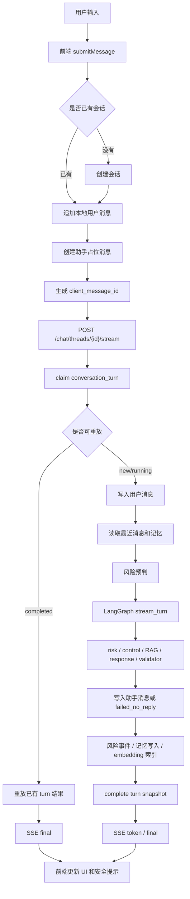

# 对话模块优化研究

## 1. 背景

本文档整理当前对话模块的代码研究结论，并给出下一轮优化方向。研究范围包括：

- 前端对话发送、SSE 接收、失败重试和安全提示。
- 后端 `chat` API、`process_message_turn` 服务流程。
- LangGraph 对话图、风险识别、控制平面、回复生成、回复校验、记忆写入。

目标不是推翻现有实现，而是把当前“安全可用的对话闭环”继续推进到更像真实心理支持产品的版本：更快、更稳、更可解释、更可维护。

## 2. 当前基线

当前对话模块已经具备以下能力：

- 前端支持文本对话、快捷回复、失败重试、风险等级显示、引用记忆展示、安全弹层。
- 后端支持会话创建、消息列表、普通发送、SSE 流式发送。
- 发送链路已有 `client_message_id`、`turn_id`、`turn_status` 和 `conversation_turns`，支持幂等 claim、重复请求重放、流式失败后 fallback 复用同一 turn。
- LangGraph 节点已拆分为 `backend/app/graphs/nodes/` 包，输入、风险、控制、RAG、回复、校验、记忆节点边界更清楚。
- 风险识别已升级为两阶段：关键词高召回 + 本地语义判别，并输出 `semantic_risk`、`risk_reason_codes`、`risk_source`、`requires_safety_check`。
- 记忆链路支持会话摘要、偏好、触发点、支持方式、关系、长期状态和内部安全摘要。
- RAG 默认关闭，但已有控制平面约束、授权语料筛选、RAG 拷贝泄露校验。

验证结果：

- 后端全量测试：`209 passed, 1 skipped`。
- 前端类型检查：上次前端改动后 `npm run check` 通过。
- 前端生产构建：上次前端改动后 `npm run build` 通过。

## 3. 当前主要链路



## 4. 核心结论

已完成的工程底座让对话链路从“能演示”推进到了“能稳定迭代”：幂等、turn 生命周期、节点拆分和两阶段风险识别已经落地。当前剩余的关键缺口集中在四类：

1. **体验延迟**：SSE 已有 `accepted / graph_update / heartbeat`，但助手文本仍是生成完成后切块发出，不是 LLM 原生 token streaming。
2. **可观测性**：现在有 `audit_tags` 和部分 metadata，但缺少节点级耗时、路由原因、RAG 命中、validator/fallback 原因的持久 trace。
3. **主链路耗时**：`upsert_memory_candidates`、`index_memory_embeddings`、`maybe_auto_consolidate_user_memories` 仍在回复交付路径里。
4. **质量闭环**：测试已经覆盖安全、端点、RAG 和记忆连续性，但对“陪伴质量”和 validator 失败修复的覆盖还不够。

## 5. P0 优先优化

### 5.1 持久化 graph trace

现状：

每轮对话已有 `turn_id` 和结果 snapshot，但 graph 决策过程没有结构化持久化。排查问题时只能从最终 message metadata、`audit_tags` 或测试复现中推断。

建议：

- 新增 `conversation_turn_traces` 表，按 `turn_id` 记录节点级 trace。
- 每个节点记录 `node_name`、`started_at`、`duration_ms`、`status`、`output_summary`、`reason_codes`、`error_code`。
- `output_summary` 只存安全摘要，不存完整用户原文。
- 普通发送和流式发送共用 trace 采集逻辑。
- 助手消息 metadata 中保留简化 trace summary，方便后台排查。

收益：

- 可以解释“为什么这轮走边界回复/危机回复/failed_no_reply”。
- 能定位慢节点、失败节点、validator 拦截原因。
- 为后续安全审核、运营指标和质量评测提供数据底座。

### 5.2 慢任务后台化

现状：

主回复路径中仍执行：

- `upsert_memory_candidates`
- `index_memory_embeddings`
- `maybe_auto_consolidate_user_memories`

这些逻辑正确，但不应该阻塞用户拿到回复，尤其 embedding、Milvus 或自动整合波动时会拖慢对话。

建议：

- 主路径只完成用户消息、助手消息、必要风险事件和 turn snapshot。
- 记忆候选写入后生成 `pending_memory_jobs`，由轻量后台 worker 执行 embedding 索引和自动整合。
- job 支持 `pending / running / completed / failed`、`retry_count`、`last_error`。
- 后台失败不影响已交付 turn，只记录 job 状态供补偿。

收益：

- 降低用户感知响应时间。
- 减少 embedding/Milvus 波动对聊天主链路的影响。
- 让记忆写入失败可以独立重试和观测。

### 5.3 原生 LLM token streaming

现状：

SSE 已经能实时发送 accepted、graph_update 和 heartbeat，但助手文本 token 仍来自最终回复切块。用户能看到进度，但不能真正边生成边显示。

建议：

- 扩展 `deepseek_client`，增加原生 streaming chat 能力。
- `response_nodes` 在模型支持时返回 token stream，同时累计最终文本用于 validator、持久化和 turn snapshot。
- SSE `token` 直接透传模型 token；模型或配置不支持 streaming 时保留当前切块 fallback。
- 保持现有前端事件协议：`accepted / graph_update / token / final / error / heartbeat`。

收益：

- 明显改善长回复等待体验。
- 保留当前稳定 fallback，不因模型 streaming 波动影响可用性。
- 为取消生成和中断恢复打基础。

## 6. P1 重要优化

### 6.1 回复质量评测集

现有测试偏安全、RAG、端点和记忆连续性。建议增加“陪伴质量”评测：

- 是否少问问题。
- 是否没有过早建议。
- 是否承接用户原话。
- 是否避免诊断。
- 是否没有承诺治疗效果。
- 是否没有强化依赖。
- 是否使用记忆但不突兀复述隐私。
- 是否在青少年模式更谨慎。

建议目录：

```text
backend/tests/evals/
├── fixtures_conversation_quality.json
├── test_conversation_quality.py
└── test_memory_use_quality.py
```

### 6.2 Validator 修复重试

现状：

`response_validator` 能阻止 RAG 拷贝泄露、危险建议、空回复等问题，但非危机场景被拦截后容易直接进入 `failed_no_reply`。

建议：

- 非危机场景 validator blocked 时允许一次安全重写。
- 重写 prompt 只包含 validator reason、response_contract、必要上下文摘要，不暴露敏感原文。
- 危机场景继续保持严格策略：不做多轮修复，不输出不确定安全回复。
- trace 中记录原始失败原因和修复是否成功。

收益：

- 减少普通支持场景的空回复。
- 保持安全场景的保守边界。
- 能积累 validator 常见失败类型，反向改进回复生成。

### 6.3 Turn 恢复查询

现状：

后端已有 turn 状态和幂等重放，前端流式异常后也会刷新消息列表。但缺少面向前端的“当前 turn 状态查询”和“刷新页面后恢复处理中状态”的完整体验。

建议：

- 新增 `GET /api/v1/chat/threads/{thread_id}/turns/latest`。
- 返回 `turn_id`、`client_message_id`、`turn_status`、`delivery_status`、`retryable`、`failure_reason`。
- 前端刷新后如果 latest turn 为 `running`，展示“仍在处理中”，并轮询或尝试 SSE 恢复。
- 手动重试继续生成新的 `client_message_id`，不复用旧 turn。

收益：

- 刷新页面、切换会话、网络中断后的状态更清楚。
- 能把“正在处理中”和“可以重试”区分开。
- 为取消生成、继续生成提供接口基础。

## 7. P2 增强方向

### 7.1 记忆引用策略更细

当前有用户可见记忆和内部安全记忆分层。下一步建议给记忆增加使用策略：

```text
silent_context     只作为背景，不显式说出
mention_allowed    可以自然提及
ask_before_use     提及前先征求用户同意
internal_only      只用于安全判断
```

收益：

- 降低用户被“突然翻旧账”的感觉。
- 更符合心理支持产品的隐私边界。
- 方便控制不同类型记忆在回复、风险判断、摘要中的使用方式。

### 7.2 RAG 灰度和质量回归

现状：

RAG 默认关闭，但授权语料筛选、控制平面约束、拷贝泄露校验已经具备基础。

建议：

- 先只在 L0/L1 非敏感支持场景灰度开启。
- 建立 RAG 质量回归：复制泄露、风格漂移、错误引用、过度模板化。
- trace 中记录 RAG 命中、skip reason、example ids。
- 前端仅展示安全的引用摘要，不展示内部筛选细节。

收益：

- 让 RAG 从“可用但关闭”进入可控实验。
- 用评测保护回复质量，不靠主观感受开关。

### 7.3 控制平面配置化

当前 `control_plane` 是对话质量和安全的中枢。后续可以把部分策略从代码提取为配置：

- 青少年模式 max question 数。
- 各风险等级 allowed moves。
- 诊断/药物/依赖/性边界/攻击行为的回复模板。
- RAG 是否允许、最多引用几个示例。
- 记忆写入策略。

收益：

- 策略实验更快，不必频繁改节点代码。
- 不同用户模式和场景可以有更清晰的策略版本。
- 便于做配置审计和回滚。

## 8. 建议落地顺序

### 第一阶段：可观测和延迟底座

1. 持久化 graph trace。
2. 增加 failed_no_reply、safety_fallback、validator_blocked 统计。
3. 慢任务后台化。
4. 建立平均响应耗时、节点耗时、记忆 job 成功率。

### 第二阶段：体验恢复

1. 原生 LLM token streaming。
2. 增加 latest turn 查询。
3. 前端刷新后恢复 running/completed/failed 状态。
4. 支持取消生成或继续等待。

### 第三阶段：回复质量

1. 陪伴质量评测集。
2. validator 修复重试。
3. 结构化回复协议，减少 `---` actions 解析脆弱性。
4. 记忆引用策略。

### 第四阶段：策略实验

1. RAG 灰度打开。
2. RAG 质量回归。
3. 控制平面配置化。
4. 风险语义规则校准集持续补充。

## 9. 推荐优先级表

| 优先级 | 优化项 | 主要收益 | 风险 |
|---|---|---|---|
| P0 | graph trace 持久化 | 可解释、可 debug、可观测 | 需要控制隐私暴露 |
| P0 | 慢任务后台化 | 降低响应延迟 | 需要任务重试机制 |
| P0 | 原生 LLM token streaming | 体验提升明显 | 需要改模型客户端和生成流程 |
| P1 | 回复质量评测 | 提升陪伴质量 | 评测标准需要迭代 |
| P1 | validator 修复重试 | 减少非危机场景空回复 | 要避免修复循环和安全降级 |
| P1 | turn 恢复查询 | 刷新/断线体验更稳定 | 需要前后端配合 |
| P2 | 记忆引用策略 | 更自然、更尊重隐私 | 需要记忆 schema 和生成策略配合 |
| P2 | RAG 灰度和质量回归 | 提升回复参考质量 | 需要防复制泄露和风格漂移 |
| P2 | 控制平面配置化 | 策略实验更快 | 配置复杂度上升 |

## 10. 代码位置索引

- 前端发送主链路：`frontend/src/App.vue` 中 `submitMessage`
- 前端 SSE 客户端：`frontend/src/api/client.ts`
- 前端 API 封装：`frontend/src/api/endpoints.ts`
- 后端对话 API：`backend/app/api/v1/endpoints/chat.py`
- 后端对话服务：`backend/app/services/chat_service.py`
- 后端对话 schema：`backend/app/schemas/chat.py`
- turn 幂等模型：`backend/app/db/models.py` 中 `ConversationTurn`
- turn 幂等迁移：`database/migrations/0010_chat_turn_idempotency.sql`
- LangGraph 主图：`backend/app/graphs/main_graph.py`
- LangGraph 输入节点：`backend/app/graphs/nodes/input_nodes.py`
- LangGraph 风险节点：`backend/app/graphs/nodes/risk_nodes.py`
- LangGraph 控制平面：`backend/app/graphs/nodes/control_nodes.py`
- LangGraph RAG 节点：`backend/app/graphs/nodes/rag_nodes.py`
- LangGraph 回复节点：`backend/app/graphs/nodes/response_nodes.py`
- LangGraph 校验节点：`backend/app/graphs/nodes/validator_nodes.py`
- LangGraph 记忆节点：`backend/app/graphs/nodes/memory_nodes.py`
- 路由函数：`backend/app/graphs/routing.py`
- 图状态定义：`backend/app/graphs/state.py`
- graph runtime：`backend/app/services/graph_runtime.py`
- 记忆服务：`backend/app/services/memory_service.py`
- RAG 示例服务：`backend/app/services/counseling_vector_service.py`
- LLM 客户端：`backend/app/services/deepseek_client.py`

## 11. 一句话总结

当前对话模块已经具备幂等、可重放、节点拆分和两阶段风险识别这些关键工程底座。下一步最值得投入的是把每轮对话变成“可观测、低延迟、可恢复、真实流式输出”的 turn 生命周期，同时补齐陪伴质量评测、validator 修复和记忆/RAG 策略，让安全、体验和质量能长期迭代。
