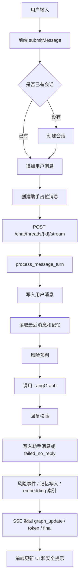

# 对话模块优化研究

## 1. 背景

本文档整理当前对话模块的代码研究结论，并给出后续优化方向。研究范围包括：

- 前端对话发送、SSE 接收、失败重试和安全提示。
- 后端 `chat` API、`process_message_turn` 服务流程。
- LangGraph 对话图、风险识别、控制平面、回复生成、回复校验、记忆写入。
- 记忆、RAG、安全评测、语音转文字回流对话等相邻链路。

目标不是推翻现有实现，而是把当前“能稳定演示的 MVP”推进到更像真实心理支持产品的版本：更快、更稳、更可解释、更可维护。

## 2. 当前基线

当前对话模块已经具备以下能力：

- 前端支持文本对话、快捷回复、失败重试、风险等级显示、引用记忆展示、安全弹层。
- 后端支持会话创建、消息列表、普通发送、SSE 流式发送。
- LangGraph 已有输入规范化、用户画像加载、风险识别、控制平面、意图识别、RAG 示例检索、回复生成、回复校验、摘要和记忆候选。
- 安全链路已经覆盖 L0/L1/L2/L3、青少年模式、知识问答、测试结果回流、语音文本回流等场景。
- 记忆链路支持会话摘要、偏好、触发点、支持方式、关系、长期状态和内部安全摘要。
- RAG 默认关闭，但已有控制平面约束、授权语料筛选、RAG 拷贝泄露校验。

验证结果：

- 后端全量测试：`195 passed, 1 skipped`。
- 前端类型检查：`npm run check` 通过。
- 前端生产构建：`npm run build` 通过。

## 3. 当前主要链路



## 4. 核心结论

当前实现方向是正确的，尤其是安全控制、记忆分层和 RAG 约束。但它仍然更像“安全可降级的演示版”，距离真实高质量对话系统还有几个关键缺口：

1. 流式体验不是真流式。后端先完整生成，再切块发给前端。
2. 请求缺少幂等键。网络中断后 fallback 可能造成重复写消息、记忆或风险事件。
3. `nodes.py` 累积多代实现。同名函数后定义覆盖前定义，维护成本高。
4. 风险识别主要依赖关键词。速度快、可测，但对隐晦表达和上下文语义不够敏感。
5. trace 没有持久化。现在有 `audit_tags`，但缺少节点级耗时、路由原因、RAG 命中、fallback 原因等完整记录。
6. 慢任务仍在主回复路径里。记忆 embedding、Milvus upsert、自动整合会拖慢用户拿到回复。
7. 质量评测偏技术和安全，对“陪伴质量”覆盖还不够。

## 5. P0 优先优化

### 5.1 真流式与实时节点进度

现状：

`/threads/{thread_id}/stream` 中先等待 `process_message_turn` 完成，然后再发送 `graph_update`、`token`、`final`。用户看到的 token 流其实是后端对最终文本的切片。

建议：

- 请求进入后立即发送 `accepted` 事件。
- 风险识别完成后发送 `graph_update: risk_classifier`。
- 记忆检索完成后发送 `graph_update: memory_retrieval`。
- RAG 决策完成后发送 `graph_update: example_retriever`。
- 回复生成阶段优先接入 LLM 原生 streaming。
- 如果 LLM 暂不支持 streaming，至少实时发送图节点进度，降低“无响应等待”的焦虑感。

建议事件：

```text
accepted
graph_update
token
final
error
heartbeat
```

收益：

- 用户体验明显提升。
- 前端可以更准确展示“正在识别风险 / 正在整理上下文 / 正在生成回复”。
- 便于后续做中断恢复和长耗时监控。

### 5.2 发送消息幂等键

现状：

前端流式失败后会 fallback 到普通发送。如果后端已经处理完，但网络断开导致前端未收到 `final`，再次普通发送可能重复写入。

建议：

- `SendMessageRequest` 增加 `client_message_id` 或 `turn_id`。
- `messages` 表或新增 `conversation_turns` 表保存该 id。
- 对同一用户、同一线程、同一 `client_message_id` 建唯一约束。
- 重复请求时直接返回已有 turn 结果。

推荐字段：

```text
client_message_id
turn_id
delivery_status
turn_status: accepted | running | completed | failed
```

收益：

- 避免重复消息。
- 避免重复写记忆和风险事件。
- 支持断线恢复、刷新页面后续接当前 turn。

### 5.3 拆分 LangGraph 节点文件

现状：

`backend/app/graphs/nodes.py` 中存在多代同名函数定义，如 `_model_reply_with_actions`、`risk_classifier`、`memory_candidate_extract`。Python 实际使用最后定义，但后续开发很容易改错位置。

建议拆分：

```text
backend/app/graphs/nodes/
├── input_nodes.py
├── risk_nodes.py
├── control_nodes.py
├── rag_nodes.py
├── response_nodes.py
├── validator_nodes.py
└── memory_nodes.py
```

同时：

- 清理或归档 `nodes_clean.py`。
- 在 `main_graph.py` 中显式导入每类节点。
- 给每个节点补充单元测试入口。

收益：

- 降低后续误改风险。
- 让控制平面、回复生成、校验、记忆写入边界更清楚。
- 方便后续做节点级 trace。

## 6. P1 重要优化

### 6.1 风险识别升级为两阶段

现状：

`sync_risk_classify` 主要依赖关键词，适合高召回 MVP，但会有两类问题：

- 漏判隐晦表达，例如“我已经安排好后事了”。
- 误判讨论性文本，例如“论文里提到自杀风险评估”。

建议：

第一阶段继续使用关键词规则，保证速度和确定性。

第二阶段增加轻量语义判别，输出结构化字段：

```json
{
  "ideation": true,
  "intent": false,
  "plan": false,
  "means": false,
  "timeframe": "none | vague | near_term",
  "protective_factor": true,
  "ambiguity": 0.3
}
```

然后由规则把结构化结果映射到 L0-L3。

收益：

- 降低误报和漏报。
- 让安全路由原因更可解释。
- 可以把“是否需要追问安全状态”做成显式策略。

### 6.2 持久化 graph trace

现状：

有 `audit_tags`，但没有完整记录每个节点如何决策。

建议新增 `conversation_turn_traces` 表，或者先写入助手消息 metadata：

```json
{
  "turn_id": "...",
  "nodes": [
    {
      "name": "risk_classifier",
      "started_at": "...",
      "duration_ms": 12,
      "output_summary": {
        "risk_level": "L1",
        "risk_reasons": ["焦虑"]
      }
    }
  ],
  "route": {
    "route_priority": "P2_support",
    "control_category": "normal_support",
    "intent": "soothe"
  },
  "rag": {
    "used": false,
    "skipped_reason": "disabled"
  },
  "memory": {
    "retrieved_count": 3,
    "write_decisions": []
  },
  "delivery": {
    "status": "generated",
    "failure_reason": null
  }
}
```

收益：

- 方便 debug：“为什么这轮走边界回复？”
- 方便质量评测：“哪些节点导致 failed_no_reply？”
- 方便后续给运营或安全审核看简化版 trace。

### 6.3 慢任务后台化

现状：

在主回复路径中执行：

- `upsert_memory_candidates`
- `index_memory_embeddings`
- `maybe_auto_consolidate_user_memories`

这些逻辑正确，但不一定应该阻塞用户拿到回复。

建议：

- 主路径只写消息和必要风险事件。
- 记忆候选先进入 `pending_memory_jobs` 或后台任务。
- embedding 索引、Milvus upsert、自动整合异步执行。
- 前端在 `final` 后可稍后刷新记忆列表。

收益：

- 降低响应时间。
- 减少 Milvus 或 embedding 服务波动对对话的影响。
- 更容易做重试和失败补偿。

### 6.4 回复质量评测集

现有测试偏安全、RAG、端点和记忆连续性。建议增加“陪伴质量”评测：

- 是否少问问题。
- 是否没有过早建议。
- 是否承接用户原话。
- 是否避免诊断。
- 是否没有承诺治疗效果。
- 是否没有强化依赖。
- 是否使用记忆但不突兀复述隐私。
- 是否在青少年模式更谨慎。

建议目录：

```text
backend/tests/evals/
├── fixtures_conversation_quality.json
├── test_conversation_quality.py
└── test_memory_use_quality.py
```

## 7. P2 增强方向

### 7.1 记忆引用策略更细

当前有用户可见记忆和内部安全记忆分层，方向很好。下一步建议给记忆增加使用策略：

```text
silent_context     只作为背景，不显式说出
mention_allowed    可以自然提及
ask_before_use     提及前先征求用户同意
internal_only      只用于安全判断
```

收益：

- 降低用户被“突然翻旧账”的感觉。
- 更符合心理支持产品的隐私边界。

### 7.2 会话中断恢复

建议给每轮对话引入 turn 状态：

```text
accepted
running
completed
failed
cancelled
```

前端刷新页面后可以查询当前 turn 状态，决定是否继续等待、展示已有结果，或允许用户重试。

### 7.3 控制平面配置化

当前 `control_plane` 已经是对话质量和安全的中枢。后续可以把部分策略从代码提取为配置：

- 青少年模式 max question 数。
- 各风险等级允许动作。
- 诊断/药物/依赖/性边界/攻击行为的回复模板。
- RAG 是否允许、最多引用几个示例。
- 记忆写入策略。

这样可以更快做产品策略实验，而不必频繁改节点代码。

## 8. 建议落地顺序

### 第一阶段：稳定工程底座

1. 拆分 `nodes.py`。
2. 增加 `turn_id / client_message_id`。
3. 增加 turn 状态和幂等返回。
4. 增加关键测试：重复发送、流式失败后 fallback、不重复写记忆。

### 第二阶段：改善用户体验

1. 改造 SSE 为实时节点进度。
2. 增加 heartbeat。
3. 前端展示更准确的阶段文案。
4. 支持中断恢复。

### 第三阶段：提升对话质量

1. 两阶段风险识别。
2. 陪伴质量评测集。
3. 记忆引用策略。
4. RAG 打开灰度实验和质量回归。

### 第四阶段：可观测和运营

1. 持久化 graph trace。
2. 建立 failed_no_reply、safety_fallback、validator_blocked 统计。
3. 建立平均响应耗时、节点耗时、RAG 命中率、记忆写入率。
4. 给安全审核提供简化 trace 视图。

## 9. 推荐优先级表

| 优先级 | 优化项 | 主要收益 | 风险 |
|---|---|---|---|
| P0 | 真流式和实时节点进度 | 体验提升最明显 | 需要改后端生成流程 |
| P0 | 幂等键和 turn 状态 | 防重复写入 | 需要数据库迁移 |
| P0 | 拆分 `nodes.py` | 降低维护风险 | 需要认真跑回归 |
| P1 | 两阶段风险识别 | 降低漏判和误判 | 需要评测集支持 |
| P1 | graph trace 持久化 | 可解释、可 debug | 需要控制隐私暴露 |
| P1 | 慢任务后台化 | 降低响应延迟 | 需要任务重试机制 |
| P1 | 陪伴质量评测 | 提升回复质量 | 评测标准需要迭代 |
| P2 | 记忆引用策略 | 更自然、更尊重隐私 | 需要前后端共同支持 |
| P2 | 控制平面配置化 | 策略实验更快 | 配置复杂度上升 |

## 10. 代码位置索引

- 前端发送主链路：`frontend/src/App.vue` 中 `submitMessage`
- 前端 SSE 客户端：`frontend/src/api/client.ts`
- 前端 API 封装：`frontend/src/api/endpoints.ts`
- 后端对话 API：`backend/app/api/v1/endpoints/chat.py`
- 后端对话服务：`backend/app/services/chat_service.py`
- LangGraph 主图：`backend/app/graphs/main_graph.py`
- LangGraph 节点：`backend/app/graphs/nodes.py`
- 路由函数：`backend/app/graphs/routing.py`
- 图状态定义：`backend/app/graphs/state.py`
- 记忆服务：`backend/app/services/memory_service.py`
- RAG 示例服务：`backend/app/services/counseling_vector_service.py`
- LLM 客户端：`backend/app/services/deepseek_client.py`

## 11. 一句话总结

当前对话模块已经具备安全 MVP 的关键闭环。下一步最值得投入的不是继续堆功能，而是把“每轮对话”升级成一个可追踪、可恢复、可幂等、可真实流式输出的 turn 生命周期；同时把 LangGraph 节点拆清楚，让安全、记忆、RAG 和回复质量都能长期迭代。
