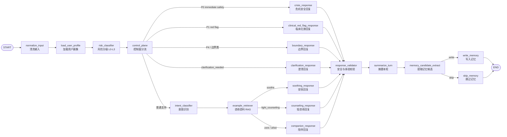

# 项目模块讲解与 LangGraph 节点图

> 项目：心理咨询 agent
> 代码位置：`E:\心理咨询agent`
> 本笔记用途：按模块解释项目结构、核心链路、LangGraph 节点职责，以及一次用户消息从前端到后端再到记忆系统的完整流动。

## 一句话总览

这个项目不是一个简单的“聊天框 + 大模型”应用，而是一个围绕心理咨询陪伴场景搭建的多层 agent 系统。

它的关键设计是：

- 前端负责用户登录、会话界面、流式展示和状态呈现。
- 后端负责认证、会话持久化、风险控制、LangGraph 对话编排、RAG、记忆、回复校验和追踪。
- PostgreSQL 是持久化真源，保存用户、会话、消息、记忆、知识库、语料索引元数据等。
- Milvus 是可重建的向量索引，用于知识库和咨询语料召回。
- LangGraph 是“一轮对话的大脑”，负责把一次用户输入拆成风险判断、控制面分流、RAG、回复、校验、摘要和记忆写入。

## 顶层目录

| 目录 | 作用 |
| --- | --- |
| `backend/` | FastAPI + LangGraph 后端，是项目核心。 |
| `frontend/` | React + Vite 前端，负责聊天应用界面。 |
| `database/migrations/` | PostgreSQL 迁移脚本，定义业务表结构。 |
| `docs/` | 开发文档、设计笔记、superpowers 计划。 |
| `资料/` | 产品、架构、计划、研究类中文资料。本笔记也放在这里，适合 Obsidian 打开。 |
| `docker-compose.milvus.yml` | 本地 Milvus 向量库启动配置。 |

## 后端模块地图

后端入口是 `backend/app/main.py`。它创建 FastAPI 应用，挂载 CORS、健康检查和 `/api/v1` 路由，并在启动时初始化数据库、启动记忆后台任务、可选预热知识索引和本地 embedding。

后端主要分为这些区域：

| 模块 | 代码位置 | 说明 |
| --- | --- | --- |
| API 路由 | `backend/app/api/v1/endpoints/` | HTTP 接口层，只做鉴权、参数校验、调用 service、返回 schema。 |
| 数据模型 | `backend/app/db/models.py` | SQLAlchemy ORM，定义用户、会话、消息、记忆、知识库、风险事件等表。 |
| Schema | `backend/app/schemas/` | Pydantic 请求/响应模型。 |
| LangGraph | `backend/app/graphs/` | 对话 agent 的节点、状态和路由。 |
| 服务层 | `backend/app/services/` | 聊天编排、记忆、RAG、embedding、Milvus、质量追踪、工具调用等业务服务。 |
| 脚本 | `backend/scripts/` | 本地测试、知识导入、语料导入、索引构建等脚本。 |
| 测试 | `backend/tests/` | 单元测试和回归测试，覆盖图、RAG、记忆、校验、流式输出等。 |

## 前端模块

前端入口是 `frontend/src/App.tsx`：

```tsx
<ProtectedAppGate>
  <NingyuAppShell />
</ProtectedAppGate>
```

这说明前端先通过 `ProtectedAppGate` 做认证/初始化，再进入主聊天壳 `NingyuAppShell`。

核心区域：

| 模块 | 代码位置 | 说明 |
| --- | --- | --- |
| 应用入口 | `frontend/src/App.tsx`、`frontend/src/main.tsx` | React 应用挂载点。 |
| 主聊天界面 | `frontend/src/app/ningyu/` | “凝语”聊天应用 shell，负责会话 UI。 |
| 登录/引导 | `frontend/src/app/auth/` | 登录态、加载页、onboarding、调试引导。 |
| 前端状态 | `frontend/src/app/state.tsx`、`session.tsx` | 管理应用状态与会话状态。 |
| API Client | `frontend/src/api/` | 封装后端 API，包含 token 刷新逻辑。 |
| UI 基础组件 | `frontend/src/components/ui/` | Spinner、VisuallyHidden 等通用组件。 |

前端 API 层有一个重要设计：`createCounselingApi()` 会创建 `ApiClient`，并把 access token 获取与 401 后 refresh token 的逻辑注入进去。这样界面层不用到处处理 token 刷新。

## API 层

API 路由集中在 `backend/app/api/v1/endpoints/`。其中最核心的是 `chat.py`。

聊天 API 提供：

- `POST /api/v1/chat/threads`：创建新会话。
- `GET /api/v1/chat/threads`：列出当前用户的会话。
- `GET /api/v1/chat/threads/{thread_id}/messages`：获取会话消息。
- `POST /api/v1/chat/threads/{thread_id}/messages`：普通非流式发送消息。
- `POST /api/v1/chat/threads/{thread_id}/stream`：SSE 流式发送消息。

API 层的职责比较克制：

1. 用 `get_current_user` 确认当前用户。
2. 用 `get_db_session` 获取数据库 session。
3. 验证请求里的 `user_id` 是否和登录用户一致。
4. 调用 `chat_service`。
5. 把 service 返回结果包装成前端需要的响应模型。

这是一种比较健康的分层：API 不直接了解 LangGraph 内部怎么跑，也不直接写复杂业务。

## Chat Service：一轮对话的外层编排

`backend/app/services/chat_service.py` 是 LangGraph 之外最重要的编排层。

它负责的是“业务上的一轮消息”，不是“图里的一个节点”。它会处理：

- 会话归属校验。
- turn 幂等控制。
- 创建用户消息。
- 取最近消息上下文。
- 构建用户画像 digest、目标状态、上下文包。
- 预分类风险等级。
- 检索长期记忆。
- 调用 `GraphRuntime`。
- 处理超时或图异常的 fallback。
- 保存 assistant 消息。
- 保存 graph trace。
- 记录风险事件。
- 入队后台记忆写入任务。
- SSE 流式输出 accepted、token、graph_update、heartbeat、final。

这层可以理解成“对话事务管理器”。它关心的是一轮请求如何可靠完成、如何落库、失败时怎么返回、重复请求怎么 replay。

刚才重构后，相关辅助逻辑被拆成：

| 模块 | 作用 |
| --- | --- |
| `chat_turn_lifecycle.py` | turn claim、幂等、replay、complete、failed、元数据。 |
| `chat_streaming.py` | stream chunk、graph update、heartbeat event。 |
| `chat_service.py` | 保留外层业务编排与稳定 patch 点。 |

## GraphRuntime：LangGraph 与业务返回之间的适配层

`backend/app/services/graph_runtime.py` 是 `chat_service` 和 LangGraph 之间的桥。

它做三件关键事：

1. 构造 `AgentState` 输入。
2. 调用编译后的 LangGraph。
3. 把图的结果映射成 API/业务层更容易使用的 dict。

它还支持两种执行方式：

- `invoke_turn()`：一次性执行完整图，返回最终结果。
- `stream_turn()`：通过 LangGraph `astream` 获取节点更新和自定义 token，适配成 SSE 事件。

`GraphRuntime` 也负责把内部状态筛选成安全的 graph update。比如它会透出风险等级、RAG trace、validator 结果、memory 写入决策等，但不会把所有内部状态原样暴露。

## LangGraph 节点图

下面是主图的 SVG 图片，Obsidian 可以直接预览：

![[assets/langgraph-main-graph.svg]]

如果当前 Obsidian 设置不显示 SVG，也可以看下面的 Mermaid 版本：



## LangGraph 状态：AgentState

`AgentState` 是整张图共享的数据结构，定义在 `backend/app/graphs/state.py`。

可以把它理解成“一轮对话的工作台”。每个节点从这里读取已有信息，再写入自己的结果。

它包含几类字段：

| 类别 | 典型字段 | 用途 |
| --- | --- | --- |
| 用户与会话 | `user_id`、`thread_id`、`user_mode` | 标识当前用户、线程和成人/青少年模式。 |
| 输入文本 | `user_text`、`normalized_text`、`input_type` | 当前输入及清洗结果。 |
| 上下文 | `recent_messages`、`last_summary`、`session_digest` | 最近对话、会话摘要、长期会话 digest。 |
| 用户画像 | `user_profile_digest`、`goal_state`、`user_context_pack` | 用户偏好、目标状态、上下文包。 |
| 风险 | `risk_level`、`risk_domain`、`immediacy`、`risk_response_policy` | 风险等级、风险域、急迫性和安全策略。 |
| 控制面 | `route_priority`、`control_category`、`response_contract` | 决定走哪种回复路径，以及回复必须遵守什么约束。 |
| RAG | `retrieved_counseling_examples`、`rag_trace_summary` | 咨询语料参考和检索链路信息。 |
| 回复 | `assistant_text`、`suggested_actions` | 模型最终给用户看的文本和按钮。 |
| 校验 | `validator_reasons`、`experience_validator_reasons`、`validator_severity` | 安全与体验校验结果。 |
| 记忆 | `memory_candidates`、`memory_write_decisions`、`should_write_memory` | 是否生成长期记忆，如何写入。 |

## 节点详解

### 1. normalize_input

位置：`backend/app/graphs/nodes/input_nodes.py`

职责：

- 把用户输入统一成 `normalized_text`。
- 给后续风险判断和意图识别提供稳定输入。

这是图的第一道“清洁入口”。后面的节点尽量不要直接依赖原始输入的各种形态。

### 2. load_user_profile

位置：`backend/app/graphs/nodes/input_nodes.py`

职责：

- 加载用户 profile。
- 写入 `profile`、`companion_preferences` 等字段。
- 为回复风格、问题容忍度、青少年模式等提供上下文。

这个节点现在比较轻，但概念上很重要：心理咨询 agent 不能只看当前一句话，也要看用户偏好和模式。

### 3. risk_classifier

位置：`backend/app/graphs/nodes/risk_nodes.py`

职责：

- 对当前文本做风险分级：`L0`、`L1`、`L2`、`L3`。
- 识别风险域、急迫性、保护性信号、原因码。
- 先走关键词与规则，再可选用 LLM refine。
- 生成 `risk_response_policy`。

风险等级大致可以理解为：

| 等级 | 含义 |
| --- | --- |
| `L0` | 普通聊天或低风险。 |
| `L1` | 有痛苦、压力、情绪困扰，但没有明确即时危险。 |
| `L2` | 较高风险，需要更谨慎的安全回应。 |
| `L3` | 立即风险或强危险信号，安全路径优先。 |

这个节点是安全系统的前置核心。后面所有 RAG、记忆和回复策略都会受它影响。

### 4. control_plane

位置：`backend/app/graphs/nodes/control_nodes.py`

职责：

- 根据风险等级、控制类别、文本明确性决定路由优先级。
- 生成 `response_contract`，约束回复能说什么、不能说什么。
- 判断是否需要澄清。
- 判断是否属于系统保护、依赖风险、性边界、辱骂、临床红旗等。

它输出的 `route_priority` 会影响路由：

| route_priority | 走向 |
| --- | --- |
| `P0_immediate_safety` | `crisis_response` |
| `P1_red_flag` | `clinical_red_flag_response` |
| `P4_system_protection` | `boundary_response` |
| 普通支持 | 继续进入 `intent_classifier` |

这是图里的“交通警察”。它不直接生成最终回复，但决定当前轮能不能进入普通咨询流程。

### 5. intent_classifier

位置：`backend/app/graphs/nodes/risk_nodes.py`

职责：

- 在通过 control plane 之后，判断用户当前意图。
- 常见意图包括 `vent`、`soothe`、`light_counseling`、`daily_checkin`、`other`。

路由逻辑在 `backend/app/graphs/routing.py`：

- `soothe` -> `soothing_response`
- `light_counseling` -> `counseling_response`
- 其它 -> `companion_response`

这里的重点是：不是所有低风险消息都走咨询式回复。有些只是闲聊、有些只是想被安抚、有些才适合轻咨询。

### 6. example_retriever

位置：`backend/app/graphs/nodes/rag_nodes.py`

职责：

- 根据当前状态决定 response mode。
- 从咨询语料库召回参考片段。
- 写入 `retrieved_counseling_examples`。
- 写入 `rag_used`、`rag_skipped_reason`、`rag_trace_summary`。

RAG 不是为了复制答案，而是为了给模型提供咨询对话的风格、节奏、回应方式参考。

项目里的咨询语料被分成三种 chunk：

| chunk | 作用 |
| --- | --- |
| `turn_pair` | 单轮 user-assistant，对局部回应风格有帮助。 |
| `process_segment` | 多轮过程片段，帮助理解咨询推进路径。 |
| `session_sketch` | 整段咨询地图，只保留主题和情绪线，不保留逐字原文。 |

召回链路大致是：

1. 对用户 query 做 embedding。
2. Milvus 粗召回。
3. 可选本地 reranker 重排。
4. 按配额选择合适 chunk。
5. 写入 prompt 参考。

### 7. response 节点族

位置：`backend/app/graphs/nodes/response_nodes.py`

这些节点都负责生成 `assistant_text` 和 `suggested_actions`，只是语气、约束和 prompt 不同。

| 节点 | 场景 | 说明 |
| --- | --- | --- |
| `crisis_response` | L2/L3 或 P0 | 安全优先，低压、短句、行动导向。 |
| `clinical_red_flag_response` | 临床红旗 | 不诊断，温和建议专业支持。 |
| `boundary_response` | 边界/系统保护 | 保持边界，不顺从不安全或越界请求。 |
| `clarification_response` | 信息不足 | 少量澄清，不硬分析。 |
| `soothing_response` | 安抚 | 稳定、陪伴、降低唤醒。 |
| `counseling_response` | 轻咨询 | 更像咨询式回应，但避免过度解释。 |
| `companion_response` | 普通陪伴 | 日常、自然、轻量。 |

回复生成会用 `dialogue_prompt_builder.py` 构造 prompt。RAG 示例、记忆、用户画像、风险策略、conversation move policy 都会被整理进 prompt，但模型最终只输出给用户看的回复和按钮。

### 8. conversation_move_policy

位置：`backend/app/services/conversation_move_policy.py`

这是项目里非常有特色的一层：它不是安全风险判断，也不是意图识别，而是“这一轮对话该怎么动”。

它关注的问题包括：

- 用户是不是只想普通闲聊？
- 用户是不是提到了作品、人物、隐喻、日常细节？
- 用户是不是在纠正上一轮“别分析我”“别一直问”？
- 最近是不是已经问太多问题了？
- 回复是不是应该继续前一条线，而不是重新开启咨询流程？
- 文化类锚点是否有足够证据，能不能谈作品细节？

刚才重构后被拆成：

| 模块 | 作用 |
| --- | --- |
| `conversation_policy_anchors.py` | 识别文学、哲学、人物、隐喻、日常细节等 topic anchor。 |
| `conversation_policy_adaptation.py` | 读取近期用户纠正与反馈，生成短期适配状态。 |
| `conversation_policy_structure.py` | 避免连续复用同一种回复结构。 |
| `conversation_move_policy.py` | 汇总以上信息，生成最终 conversation move policy。 |

这个模块对体验影响很大。它让 agent 不会每轮都像“咨询师模板”一样开头、分析、追问，而是更像一个能记住对话节奏的人。

### 9. response_validator

位置：

- `backend/app/graphs/nodes/validator_nodes.py`
- `backend/app/graphs/nodes/validator_experience.py`

职责：

- 检查安全问题：诊断泄露、用药建议、危险方法、妄想确认、依赖强化、绝对保密承诺、角色冒充等。
- 检查体验问题：模板词、问题过多、重复安全问题、过度心理化、忽略 topic anchor、泛化按钮、文化作品胡编等。
- 区分 warning 和 blocking。
- 必要时调用模型重新生成。
- 如果重生成仍失败，返回 failed_no_reply。

这个节点非常关键，因为它是模型输出真正给用户之前的最后一道闸。

体验校验中有几个很贴近这个项目气质的规则：

- 不要过度使用“听起来/我理解/我听见”式固定开头。
- 不要在普通闲聊里强行解释成创伤、防御或病理。
- 不要把用户刚提的具体锚点泛化成普通情绪。
- 不要连续复用同一种回复结构。
- 不确定作品细节时不要虚构剧情、角色或作者意图。
- 用户已经说“别分析/别追问/别问安全”时，下一轮必须真的改变。

### 10. summarize_turn

位置：`backend/app/graphs/nodes/memory_nodes.py`

职责：

- 根据本轮用户输入和 assistant 回复生成 session summary。
- 更新 `session_digest`。
- 为后续会话连续性提供短摘要。

这个节点不是长期记忆写入本身，而是把本轮对话压缩成可以继续使用的上下文。

### 11. memory_candidate_extract

位置：`backend/app/graphs/nodes/memory_nodes.py`

职责：

- 判断本轮是否有值得长期保存的记忆候选。
- 生成 `memory_candidates`。
- 根据风险和隐私策略给出 `memory_policy`。

心理咨询场景里的记忆很敏感，所以这里不能“什么都记”。它要考虑：

- 是否用户可见。
- 是否涉及敏感内容。
- 是否是高风险对话。
- 是否只是短期上下文，不应长期保存。
- 是否已经有相似记忆。

### 12. write_memory / skip_memory

位置：`backend/app/graphs/nodes/memory_nodes.py`

`route_memory_write()` 决定最后走哪条路：

- 如果 `delivery_status == failed_no_reply`，跳过。
- 如果用户记忆模式是 `off`，跳过。
- 如果没有候选记忆，跳过。
- 否则写入。

当前业务层还引入了后台 memory job：有些记忆写入会被 `chat_service` 包装成 `PendingMemoryJob`，交给后台任务异步处理，避免阻塞聊天响应。

## 记忆系统

位置：

- `backend/app/services/memory_service.py`
- `backend/app/services/memory_scoring.py`
- `backend/app/services/memory_job_service.py`
- `backend/app/graphs/nodes/memory_nodes.py`

记忆系统大致分三步：

1. 读：聊天前检索用户相关记忆，构建 `retrieved_memories` 和 `memory_index`。
2. 用：GraphRuntime 把记忆放进 AgentState，prompt builder 再把合适内容放进 prompt。
3. 写：聊天后提取候选记忆，按策略写入或跳过。

`memory_scoring.py` 负责文本清洗、tokenize、相似度和是否比较内容。这些是纯函数，适合单独测试。

需要注意：高风险场景会限制记忆引用，避免把不合适的长期记忆带入危机回复。

## 知识库与咨询语料 RAG

项目有两类知识/语料：

### 1. Knowledge articles

表包括：

- `knowledge_articles`
- `knowledge_sources`
- `knowledge_chunks`
- `knowledge_gaps`

主要用于心理健康知识内容，支持导入、审核、发布、chunking 和检索。

### 2. Counseling corpus

表包括：

- `counseling_corpus_sources`
- `counseling_example_chunks`

主要用于咨询对话风格参考。它不是“知识问答”，而是让模型学习更合适的回应节奏。

Milvus 只是索引。真正内容、来源、许可和审核状态仍以 PostgreSQL 为准。

## 数据库模型

核心表可以分为几组：

| 组 | 表 | 说明 |
| --- | --- | --- |
| 用户 | `users`、`user_profiles`、`user_settings`、`refresh_tokens` | 账号、画像、设置、登录 token。 |
| 会话 | `conversation_threads`、`messages`、`conversation_turns`、`conversation_turn_traces` | 会话、消息、幂等 turn、图执行 trace。 |
| 记忆 | `user_memories`、`memory_embeddings`、`memory_operations`、`memory_consolidation_runs`、`pending_memory_jobs` | 长期记忆、embedding、操作日志、合并任务、后台写入任务。 |
| 安全 | `risk_events` | 风险事件审计。 |
| 知识库 | `knowledge_articles`、`knowledge_sources`、`knowledge_chunks`、`knowledge_gaps` | 心理健康知识内容。 |
| 咨询语料 | `counseling_corpus_sources`、`counseling_example_chunks` | 咨询 RAG 语料。 |

## 一次用户消息的完整链路

1. 前端在 `NingyuAppShell` 里发送消息。
2. API client 带 access token 请求 `/api/v1/chat/...`。
3. `chat.py` 做鉴权和 thread 校验。
4. `chat_service.process_message_turn` 或 `process_message_turn_stream` claim 一个 turn。
5. 写入 user message。
6. 预分类风险，构建用户画像、目标状态、上下文包。
7. 检索长期记忆。
8. 调用 `GraphRuntime`。
9. LangGraph 依次执行输入、风险、控制、RAG、回复、校验、摘要、记忆候选。
10. `GraphRuntime` 把图结果映射成业务结果。
11. `chat_service` 保存 assistant message、trace、风险事件、记忆任务。
12. API 返回最终响应，或者 SSE 持续推送 token / graph_update / final。

## 这个架构的优点

### 1. 安全和体验不是事后补丁

风险判断、控制面、回复契约、validator 都在主链路里。模型不是自由发挥后才被简单过滤，而是在生成前后都有约束。

### 2. 对话不是单轮孤立的

最近消息、session summary、session digest、用户画像、目标状态、长期记忆都会进入当前轮。系统具备连续性。

### 3. RAG 更偏“咨询过程参考”

咨询语料 RAG 的目标不是照搬答案，而是提供回应方式和节奏参考。validator 也会防止复制 RAG 原文。

### 4. 记忆写入是谨慎的

记忆不是默认全写，而是经过候选提取、隐私/风险策略、相似度判断和后台任务处理。

### 5. 可观察性较好

Graph trace、RAG trace、validator reasons、conversation quality trace、memory decisions 都被保留，方便调试“为什么这一轮这么回复”。

## 当前重构后的模块边界

最近一次重构主要让大文件变清晰：

| 原始区域 | 新边界 |
| --- | --- |
| memory 相似度逻辑 | `memory_scoring.py` |
| chat turn 生命周期 | `chat_turn_lifecycle.py` |
| chat streaming 事件 | `chat_streaming.py` |
| 对话锚点识别 | `conversation_policy_anchors.py` |
| 用户纠偏/短期适配 | `conversation_policy_adaptation.py` |
| 回复结构变化 | `conversation_policy_structure.py` |
| validator 体验规则 | `validator_experience.py` |

facade 文件仍保留：

- `chat_service.py`
- `memory_service.py`
- `conversation_move_policy.py`
- `validator_nodes.py`

这样既精简了文件，又没有破坏原来的公开导入路径和测试 patch 点。

## 阅读代码的推荐顺序

如果要继续理解或开发，我建议按这个顺序读：

1. `backend/app/api/v1/endpoints/chat.py`：先看 HTTP 入口。
2. `backend/app/services/chat_service.py`：理解一轮消息如何落库、调用图、处理流式。
3. `backend/app/services/graph_runtime.py`：理解图输入输出如何映射。
4. `backend/app/graphs/main_graph.py`：看完整节点拓扑。
5. `backend/app/graphs/routing.py`：看条件路由。
6. `backend/app/graphs/state.py`：看节点共享状态。
7. `backend/app/graphs/nodes/risk_nodes.py` 和 `control_nodes.py`：理解安全控制。
8. `backend/app/graphs/nodes/response_nodes.py`：理解 prompt 和回复生成。
9. `backend/app/graphs/nodes/validator_nodes.py` 与 `validator_experience.py`：理解输出闸门。
10. `backend/app/services/memory_service.py` 与 `memory_nodes.py`：理解长期记忆。
11. `backend/app/services/counseling_*` 与 `rag_nodes.py`：理解咨询语料 RAG。
12. `frontend/src/app/ningyu/NingyuAppShell.tsx`：最后看前端如何呈现这一切。

## 开发时最容易踩的点

- 不要绕过 `chat_service` 直接调用图，否则会漏掉 turn 幂等、消息落库、trace 和记忆任务。
- 不要把 Milvus 当真源；它只是索引，内容真源在 PostgreSQL。
- 不要在高风险场景随便引用长期记忆或 RAG。
- 修改 response 节点时要同步看 validator，因为很多“看起来能生成”的回复会被体验校验拦下。
- 修改 `AgentState` 字段时要检查 GraphRuntime、trace、prompt builder、tests。
- 修改 API 响应时要同步检查前端 `types/api.ts` 和 API client。
- 修改对话策略时要跑 conversation move policy、dialogue prompt builder、conversation control RAG 相关测试。

## 最小验证命令

后端快速编译：

```powershell
cd E:\心理咨询agent\backend
.\.venv\Scripts\python.exe -m compileall app
```

核心回归测试：

```powershell
cd E:\心理咨询agent\backend
.\.venv\Scripts\python.exe -m pytest tests/test_backend_refactor_contract.py tests/test_memory_service.py tests/test_memory.py tests/test_chat_idempotency.py tests/test_conversation_move_policy.py tests/test_conversation_control_rag.py tests/test_dialogue_prompt_builder.py tests/test_graph_runtime_streaming.py tests/test_response_memory_continuity.py -q
```

前端类型检查：

```powershell
cd E:\心理咨询agent\frontend
npm run check
```

## 结语

这个项目的核心价值不在“调用一次大模型”，而在于把心理咨询陪伴场景里真正麻烦的东西系统化：风险优先级、边界、短期适配、长期记忆、RAG 参考、体验校验、失败兜底和可追踪性。

从架构上看，它已经有一个比较完整的 agent 后端骨架。之后继续演进时，最值得守住的是模块边界：API 负责入口，service 负责业务事务，LangGraph 负责一轮对话推理，validator 负责出口闸门，memory/RAG 负责上下文增强。
